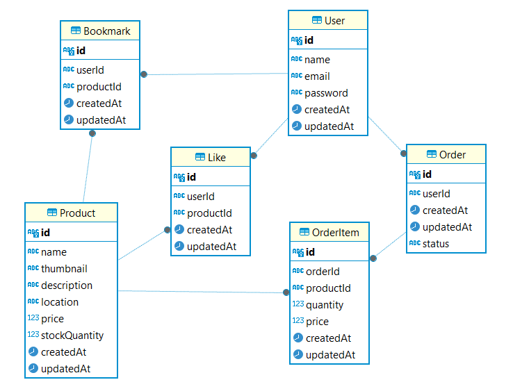

# MyTravel API Documentation

## Demo Backend

### Demo Link API: [MyTravel API Demo](https://api-mytravel.hackimtech.com)

## Description

MyTravel is a comprehensive application designed to manage travel-related orders, including products, bookmarks, and order systems. The application allows users to add products to their bookmarks, place orders, and track the status of their orders.

## Installation Guide

Clone the Repository

```bash
git clone https://github.com/hackim18/mytravel.git
```

Navigate to the Project Directory

```bash
cd mytravel
cd backend
```

Install Dependencies

```bash
npm install
```

Configure the Database
Create a `.env` file at the root of the project and add your database URL:

```env
DATABASE_URL="your-database-url"
JWT_SECRET="your-jwt-secret"
```

Run Database Migration and Seeding

```bash
npm run migrate
npm run seed
```

Start the Application

```bash
npm run dev
```

Access the Application
Open your browser and navigate to [http://localhost:3000](http://localhost:3000).

## Database Schema

The following diagram represents the database schema for the MyTravel application:



## API Endpoints

### 1. User Management

#### - Register User

- Endpoint: `POST /register`
- Description: Register a new user.
- Request Body:
  ```json
  {
    "name": "string",
    "email": "string",
    "password": "string"
  }
  ```
- Response:
  ```json
  {
    "message": "User created successfully",
    "data": {
      "name": "string",
      "email": "string"
    }
  }
  ```
- Status Codes:
  - 201 Created - User successfully registered.
  - 400 Bad Request - Invalid data provided.

#### - Login User

- Endpoint: `POST /login`
- Description: Authenticate a user and generate a token.
- Request Body:
  ```json
  {
    "email": "string",
    "password": "string"
  }
  ```
- Response:
  ```json
  {
    "access_token": "string"
  }
  ```
- Status Codes:
  - 200 OK - Successfully authenticated.
  - 400 Bad Request - Invalid credentials.

#### - Get User Profile

- Endpoint: `GET /profile`
- Description: Retrieve the profile information of the authenticated user.
- Response:
  ```json
  {
    "id": "string",
    "name": "string",
    "email": "string"
  }
  ```
- Status Codes:
  - 200 OK - User profile successfully retrieved.
  - 401 Unauthorized - Authentication required.

### 2. Product Management

#### - Get All Products

- Endpoint: `GET /products`
- Description: Retrieve a list of all products.
- Response:
  ```json
  [
    {
      "id": "string",
      "name": "string",
      "thumbnail": "string",
      "description": "string",
      "location": "string",
      "price": "int",
      "stockQuantity": "int",
      "createdAt": "string",
      "updatedAt": "string",
      "likes": "array"
    }
  ]
  ```
- Status Codes:
  - 200 OK - Products successfully retrieved.
  - 401 Unauthorized - Authentication required.

#### - Create Product

- Endpoint: `POST /product`
- Description: Create a new product.
- Request Body:
  ```json
  {
    "name": "string",
    "thumbnail": "string",
    "description": "string",
    "location": "string",
    "price": "int",
    "stockQuantity": "int"
  }
  ```
- Response:
  ```json
  {
    "id": "string",
    "name": "string",
    "thumbnail": "string",
    "description": "string",
    "location": "string",
    "price": "int",
    "stockQuantity": "int",
    "createdAt": "string",
    "updatedAt": "string"
  }
  ```
- Status Codes:
  - 201 Created - Product successfully created.
  - 400 Bad Request - Invalid data provided.

#### - Get Product by ID

- Endpoint: `GET /product/{id}`
- Description: Retrieve a specific product by ID.
- Request Parameters:
  - id: The ID of the product.
- Response:
  ```json
  {
    "id": "string",
    "name": "string",
    "thumbnail": "string",
    "description": "string",
    "location": "string",
    "price": "int",
    "stockQuantity": "int",
    "createdAt": "string",
    "updatedAt": "string",
    "likes": "array"
  }
  ```
- Status Codes:
  - 200 OK - Product successfully retrieved.
  - 404 Not Found - Product not found.

#### - Get All Favorite Products

- Endpoint: `GET /products/favorite`
- Description: Retrieve a list of all favorite products of the authenticated user.
- Response:
  ```json
  [
    {
      "id": "string",
      "name": "string",
      "thumbnail": "string",
      "description": "string",
      "location": "string",
      "price": "int",
      "stockQuantity": "int",
      "createdAt": "string",
      "updatedAt": "string",
      "likes": "array"
    }
  ]
  ```
- Status Codes:
  - 200 OK - Favorite products successfully retrieved.
  - 401 Unauthorized - Authentication required.

#### - Like or Unlike Product

- Endpoint: `POST /product/{id}/like`
- Description: Like or unlike a product.
- Request Parameters:
  - id: The ID of the product.
- Response:
  ```json
  {
    "message": "Product liked or unliked successfully"
  }
  ```
- Status Codes:
  - 200 OK - Product successfully liked or unliked.
  - 400 Bad Request - Invalid product ID.
  - 401 Unauthorized - Authentication required.

#### - Update Product

- Endpoint: `PUT /product/{id}`
- Description: Update an existing product.
- Request Parameters:
  - id: The ID of the product.
- Request Body:
  ```json
  {
    "name": "string",
    "thumbnail": "string",
    "description": "string",
    "location": "string",
    "price": "int",
    "stockQuantity": "int"
  }
  ```
- Response:
  ```json
  {
    "id": "string",
    "name": "string",
    "thumbnail": "string",
    "description": "string",
    "location": "string",
    "price": "int",
    "stockQuantity": "int",
    "createdAt": "string",
    "updatedAt": "string"
  }
  ```
- Status Codes:
  - 200 OK - Product successfully updated.
  - 400 Bad Request - Invalid data provided.
  - 404 Not Found - Product not found.

#### - Delete Product

- Endpoint: `DELETE /product/{id}`
- Description: Delete a product by ID.
- Request Parameters:
  - id: The ID of the product.
- Response:
  ```json
  {
    "message": "Product deleted successfully"
  }
  ```
- Status Codes:
  - 200 OK - Product deleted successfully.
  - 404 Not Found - Product not found.

### 3. Bookmark Management

#### - Create Bookmark

- Endpoint: `POST /bookmark`
- Description: Add a product to the user's bookmarks.
- Request Body:
  ```json
  {
    "productId": "string"
  }
  ```
- Response:
  ```json
  {
    "id": "string",
    "userId": "string",
    "productId": "string",
    "createdAt": "string",
    "updatedAt": "string"
  }
  ```
- Status Codes:
  - 201 Created - Bookmark successfully created.
  - 400 Bad Request - Invalid data provided.
  - 401 Unauthorized - Authentication required.

#### - Get Bookmarks by User ID

- Endpoint: `GET /bookmark`
- Description: Retrieve all bookmarks of the authenticated user.
- Response:
  ```json
  [
    {
      "id": "string",
      "userId": "string",
      "productId": "string",
      "createdAt": "string",
      "updatedAt": "string"
    }
  ]
  ```
- Status Codes:
  - 200 OK - Bookmarks successfully retrieved.
  - 401 Unauthorized - Authentication required.

#### - Delete Bookmark

- Endpoint: `DELETE /bookmark/{productId}`
- Description: Remove a bookmark for a specific product.
- Request Parameters:
  - productId: The ID of the product.
- Response:
  ```json
  {
    "message": "Bookmark successfully deleted"
  }
  ```
- Status Codes:
  - 200 OK - Bookmark successfully deleted.
  - 404 Not Found - Bookmark not found.
  - 401 Unauthorized - Authentication required.

### 4. Order Management

#### - Create Order

- Endpoint: `POST /order`
- Description: Place a new order.
- Request Body:
  ```json
  {
    "items": [
      {
        "productId": "cuid3",
        "quantity": 2
      },
      ...
    ],
  }
  ```
- Response:
  ```json
  {
    "id": "string",
    "userId": "string",
    "totalAmount": "int",
    "status": "string",
    "createdAt": "string",
    "updatedAt": "string",
    "items": "array"
  }
  ```
- Status Codes:
  - 201 Created - Order successfully placed.
  - 400 Bad Request - Invalid data provided.
  - 401 Unauthorized - Authentication required.

#### - Get Orders by User ID

- Endpoint: `GET /order`
- Description: Retrieve all orders of the authenticated user.
- Response:
  ```json
  [
    {
      "id": "string",
      "userId": "string",
      "totalAmount": "int",
      "status": "string",
      "createdAt": "string",
      "updatedAt": "string",
      "items": "array"
    }
  ]
  ```
- Status Codes:
  - 200 OK - Orders successfully retrieved.
  - 401 Unauthorized - Authentication required.

#### - Update Order Status

- Endpoint: `PUT /order/{orderId}`
- Description: Update the status of an existing order.
- Request Parameters:
  - orderId: The ID of the order.
- Request Body:
  ```json
  {
    "status": "string"
  }
  ```
- Response:
  ```json
  {
    "id": "string",
    "userId": "string",
    "totalAmount": "int",
    "status": "string",
    "createdAt": "string",
    "updatedAt": "string"
  }
  ```
- Status Codes:
  - 200 OK - Order status successfully updated.
  - 400 Bad Request - Invalid data provided.
  - 404 Not Found - Order not found.
  - 401 Unauthorized - Authentication required.

#### - Delete Order

- Endpoint: `DELETE /order/{orderId}`
- Description: Delete an existing order.
- Request Parameters:
  - orderId: The ID of the order.
- Response:
  ```json
  {
    "message": "Order deleted"
  }
  ```
- Status Codes:
  - 200 OK - Order deleted.
  - 404 Not Found - Order not found.
  - 401 Unauthorized - Authentication required.

## License

This project is licensed under the MIT License. See the LICENSE file for more details.
